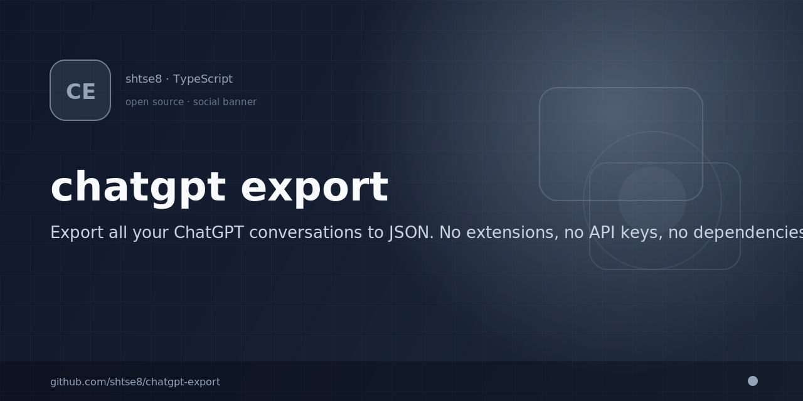

# 💬 ChatGPT Export

<p align="center">
  
</p>


### Export all your ChatGPT conversations — JSON, Markdown, Text, or HTML

[](https://github.com/shtse8/chatgpt-export/actions/workflows/ci.yml)
[](https://chromewebstore.google.com/detail/chatgpt-export/elkdhnegeooliobekanjpdifoaoolbbf)
[](LICENSE)
[](https://www.typescriptlang.org/)
[](https://github.com/shtse8/chatgpt-export/stargazers)

No API keys. No external servers. No dependencies. Works with **Team/Business** plans that have no built-in export. Your data stays in your browser.

---

## ✨ Features

- 📤 **Multiple export formats** — JSON, Markdown, Plain Text, or styled HTML
- 🔑 **Auto-authentication** — uses your existing session, no API key needed
- 📄 **Full pagination** — exports all conversations, even thousands
- 🔄 **Smart retry** — exponential backoff with jitter on rate limits
- 🔃 **Token refresh** — handles expired tokens mid-export seamlessly
- ⚡ **Concurrent downloads** — configurable parallel downloads (default 3)
- 📊 **Live progress** — speed, ETA, count, current conversation in real-time
- 🔍 **Search & filter** — export only conversations matching a keyword
- 📅 **Incremental export** — export only new conversations since last export
- 🎯 **Selective export** — choose specific conversations to export
- 🌗 **Dark & light mode** — auto-adapts to your system preference
- 🛡️ **Error resilient** — continues on failures, reports errors at the end
- 💾 **Auto-download** — file saves automatically when done
- 🧩 **5 install methods** — extension, userscript, bookmarklet, console, inject

## 📦 Export Formats

| Format | Extension | Best For |
|--------|-----------|----------|
| **JSON** | `.json` | Data analysis, programmatic processing, full fidelity |
| **Markdown** | `.md` | Reading, documentation, version control |
| **Plain Text** | `.txt` | Simple archival, universal compatibility |
| **HTML** | `.html` | Beautiful viewing in browser, sharing, printing |

The HTML export is self-contained with inline CSS and supports both dark and light mode.

## 📦 Installation

### 🧩 Chrome Extension (Recommended)

Install from the [Chrome Web Store](https://chromewebstore.google.com/detail/chatgpt-export/elkdhnegeooliobekanjpdifoaoolbbf).

Or install manually from source:

1. Download the [latest release ZIP](https://github.com/shtse8/chatgpt-export/releases/latest)
2. Go to `chrome://extensions/`
3. Enable **Developer mode** (top right)
4. Click **Load unpacked** → select the extracted folder
5. Navigate to [chatgpt.com](https://chatgpt.com) → click the extension icon

### 🐒 Userscript (Tampermonkey / Violentmonkey)

1. Install [Tampermonkey](https://www.tampermonkey.net/) or [Violentmonkey](https://violentmonkey.github.io/)
2. Click to install: **[chatgpt-export.user.js](https://github.com/shtse8/chatgpt-export/releases/latest/download/chatgpt-export.user.js)**
3. Navigate to [chatgpt.com](https://chatgpt.com) — a floating widget appears in the bottom-right
4. Select your format and click **Export All**

### 🔖 Bookmarklet

1. Go to the latest [release page](https://github.com/shtse8/chatgpt-export/releases/latest)
2. Download `bookmarklet.txt` and copy its contents
3. Create a new bookmark in your browser, paste the contents as the URL
4. Click the bookmark while on [chatgpt.com](https://chatgpt.com)

### 📋 Console Paste

1. Go to [chatgpt.com](https://chatgpt.com) and sign in
2. Open DevTools: **F12** → **Console** tab
3. Copy the contents of [`inject.js`](https://github.com/shtse8/chatgpt-export/releases/latest/download/inject.js)
4. Paste and press **Enter**
5. Choose your export format when prompted
6. Wait for the file to auto-download

## 🚀 Usage

### Chrome Extension

1. Navigate to [chatgpt.com](https://chatgpt.com) and sign in
2. Click the extension icon in the toolbar
3. Choose your **export format** (JSON, Markdown, Text, HTML)
4. Choose your **export scope**:
   - **All conversations** — export everything
   - **New since last export** — only conversations updated since your last export
   - **Search by title** — filter by keyword
5. Click **▶ Export**
6. Watch the live progress dashboard
7. File downloads automatically when complete

### Userscript

1. The floating widget appears on chatgpt.com
2. Select your format from the dropdown
3. Click **▶ Export All**
4. Monitor progress in the widget

## ⚙️ Configuration

When using the engine programmatically (console/inject), you can customize:

```typescript
const engine = new ExportEngine({
  format: 'markdown',     // 'json' | 'markdown' | 'text' | 'html'
  concurrency: 5,         // parallel downloads (default: 3)
  batchSize: 100,         // conversations per page when listing
  retryAttempts: 3,       // max retries per request
  retryDelay: 2000,       // base retry delay in ms (exponential)
  searchQuery: 'react',   // filter by title keyword
  afterTimestamp: Date.now() - 7 * 24 * 60 * 60 * 1000, // last 7 days
  conversationIds: ['id1', 'id2'],  // specific conversations only
})
```

## 📊 Plan Compatibility

| Plan | Built-in Export? | This Tool |
|------|:---:|:---:|
| Free | ✅ | ✅ |
| Plus | ✅ | ✅ |
| Team | ❌ | ✅ |
| Business | ❌ | ✅ |
| Enterprise | ✅ (Compliance API) | ✅ |

## ❓ FAQ

**Does it work with ChatGPT Teams/Business?**
Yes! That's the primary use case. Team and Business plans have no built-in export feature.

**Does it send my data to any external server?**
No. Everything runs locally in your browser. No data leaves your machine. See our [Privacy Policy](PRIVACY.md).

**How long does a large export take?**
Depends on the number of conversations. With default settings (concurrency: 3), expect ~100 conversations per minute. A 1,000 conversation export takes about 10 minutes.

**Can I export specific conversations?**
Yes. Use the "Search by title" option in the extension, or pass `conversationIds` when using the engine directly.

**Does it export images and files?**
The JSON export contains URLs to attached files. These URLs may expire over time. Binary content is not embedded.

**Will it work if ChatGPT changes their API?**
The tool uses ChatGPT's internal API. If they change it, we'll update. Star the repo to stay notified.

## 🔧 Development

```bash
# Install dependencies
bun install

# Build all formats (extension + standalone + userscript + bookmarklet)
bun run build

# Type check
bun run typecheck

# Run tests
bun run test

# Lint
bun run lint

# Package extension as ZIP
bun run package
```

### Project Structure

```
src/
├── core/                    # Shared export engine
│   ├── config.ts            # Configuration types and defaults
│   ├── event-emitter.ts     # Typed EventEmitter implementation
│   ├── export-engine.ts     # Core export engine
│   ├── utils.ts             # Logging and utility functions
│   ├── index.ts             # Public API exports
│   └── formatters/          # Export format implementations
│       ├── index.ts          # Formatter registry and types
│       ├── conversation-parser.ts  # ChatGPT conversation structure parser
│       ├── json.ts           # JSON formatter
│       ├── markdown.ts       # Markdown formatter
│       ├── text.ts           # Plain text formatter
│       └── html.ts           # Self-contained HTML formatter
├── extension/               # Chrome Extension (Manifest V3)
│   ├── manifest.json
│   ├── background.ts        # Service worker + badge updates
│   ├── content.ts           # Content script (runs on chatgpt.com)
│   └── popup/               # Extension popup UI
│       ├── popup.html
│       ├── popup.css
│       └── popup.ts
├── standalone/              # Console injection IIFE
│   └── inject.ts
└── userscript/              # Tampermonkey/Violentmonkey script
    └── chatgpt-export.user.ts
tests/                       # Vitest test suite
```

### Architecture

- **Multi-target build**: Single TypeScript source → 5 output targets
- **IIFE bundles**: Each target is a self-contained IIFE (no code splitting)
- **Build tool**: Bun + Vite in library mode
- **No runtime dependencies**: Everything is bundled at build time

## 🚀 Releasing

```bash
# Bump version in package.json, then:
git tag v2.0.0
git push origin main --tags
```

GitHub Actions will automatically:
1. Run tests and type checking
2. Build all formats
3. Create a GitHub Release with all artifacts
4. Upload to Chrome Web Store (if secrets configured)

## 🔒 Privacy

This tool runs entirely in your browser. No data is sent to any external server. We do not collect, store, or transmit any of your conversation data.

See our full [Privacy Policy](PRIVACY.md).

## ⚖️ Legal

This tool accesses your own data through your own authenticated browser session. Under **GDPR** and **UK GDPR** (Article 15), you have the right to obtain a copy of your personal data.

## 🤝 Contributing

Contributions are welcome! Please:

1. Fork the repository
2. Create a feature branch (`git checkout -b feat/my-feature`)
3. Make your changes with tests
4. Ensure `bun run typecheck && bun run test && bun run build` all pass
5. Submit a pull request

## 📄 License

MIT © [Kyle Tse](https://github.com/shtse8)
